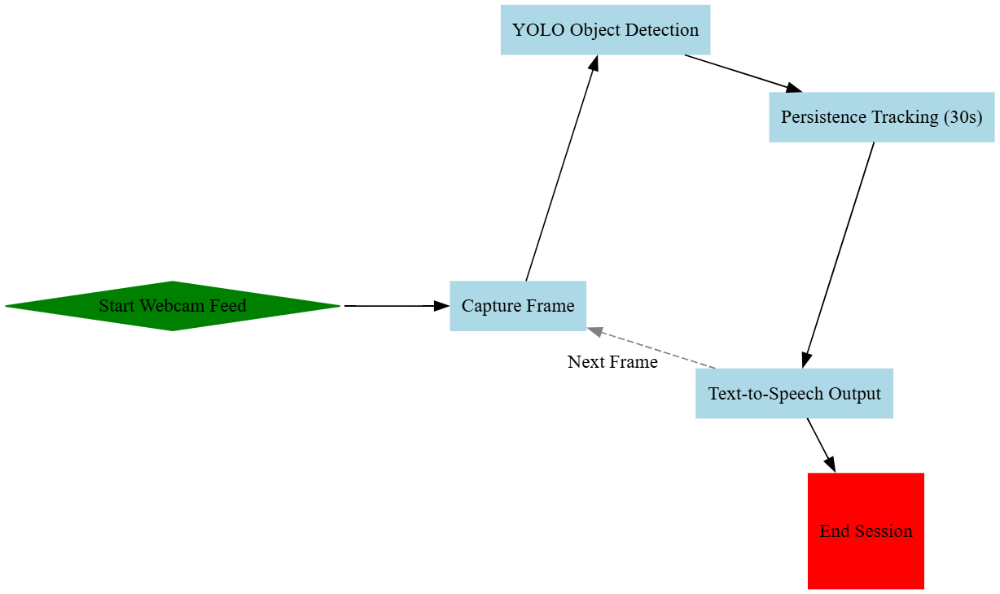

# 🎯 Object Identification & Recognition with CNN + Sound


**Real-time object detection with live TTS announcements!** 🖥️🔊  
Detect everyday objects in a webcam feed and hear them spoken aloud **only after they remain visible for 30 seconds**.  

---

## 🚀 Features
| Feature | Status |
|---------|--------|
| Real-time detection (YOLOv11n) | ✅ |
| Color webcam feed with bounding boxes | ✅ |
| 30-second persistence tracking | ✅ |
| Text-to-Speech integration (pyttsx3) | ✅ |
| Modular code (detection, tracking, TTS) | ✅ |
| Custom object support | 🔧 |
| Multi-language TTS | 🔧 |

---

## 📊 Workflow



---

## 🚀 Features
- 🟢 **Real-time detection** with YOLOv11n pretrained on COCO.  
- 🎨 **Color webcam feed** with bounding boxes and labels.  
- ⏱️ **30-second persistence tracking** to announce only stable objects.  
- 🔊 **Text-to-Speech** integration using `pyttsx3`.  
- 🧩 **Modular code**: separate functions for detection, tracking, and TTS.  
- 📋 Final **stable objects list** printed at the end for verification.  

---

## ⚡ Quick Start

### 1️⃣ Clone the repository
```bash
git clone https://github.com/yourusername/object-identification-cnn.git
cd object-identification-cnn
```

### 2️⃣ Install dependencies
```
pip install -r requirements.txt
```

---

## 🖥️ Usage
- Run the Jupyter notebook (`obj_soundv2.ipynb`) and execute cells in order.
- Or convert to Python script and run:
   python obj_sound.py
- Press `q` to quit the webcam feed.
- Objects that remain visible for 30 seconds will be announced via TTS.
> Tip: Lower the threshold in update_object_tracking() for faster testing (e.g., 5 seconds).

---

## 📂 Project Structure

```
object-identification-cnn/
│
├── obj_soundv2.py
├── README.md
├── assets/
└── requirements.txt
```

---

## 🔗 References
- Ayan Ravindra Jambhulkar, Akshay Rameshbhai Gajera, Chirag Manoj Bhavsar, Shilpa Vatkar, Real-Time Object Detection and Audio Feedback for the Visually Impaired.
- Hoa Nguyen, Minh Nguyen, Quan Nguyen, Shu Yang, Huy Le, Web-based object detection and sound feedback system for visually impaired people.
- Joseph Redmon, Santosh Divvala, Ross Girshick, Ali Farhadi, You Only Look Once: Unified, Real-Time Object Detection.
- [Ultralytics YOLO Documentation](https://docs.ultralytics.com/)
- [pyttsx3 Documentation](https://pyttsx3.readthedocs.io/)
- COCO Dataset: http://cocodataset.org/
